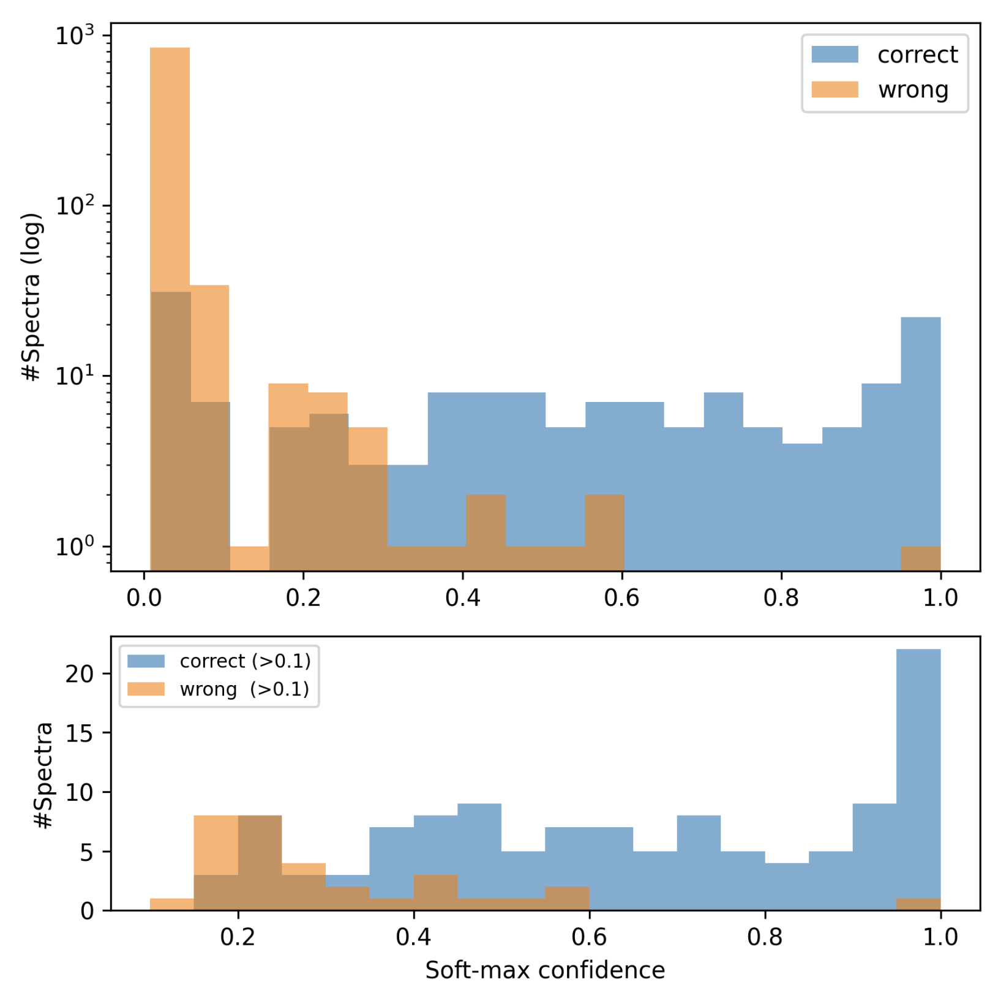

## DDPM‑Raman: Diffusion‑Based Data Augmentation for 2D‑Material Raman Spectra

Goal: implement and extend the workflow from Qi et al., 2023. “Deep Learning Assisted Raman Spectroscopy for Rapid Identification of 2D Materials” using Denoising Diffusion Probabilistic Models (DDPMs) to synthesize realistic Raman spectra and boost classification of 2D materials.

## 1. Quick Start

git clone https://github.com/sutharsikakumar/ddpm-raman.git
cd ddpm-raman

python3 -m venv venv && source venv/bin/activate
pip install -r requirements.txt

python scripts/fetch_reference_sets.py
python scripts/preprocess_qi2023.py  --raw data/original
python train_ddpm.py --config configs/qi2023.yaml
python train_classifier.py --config configs/cnn.yaml

python evaluate.py --ckpt runs/cnn_ddpm.pth

## 2. Example figures

